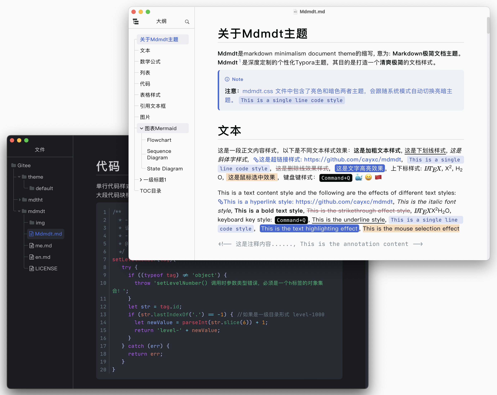
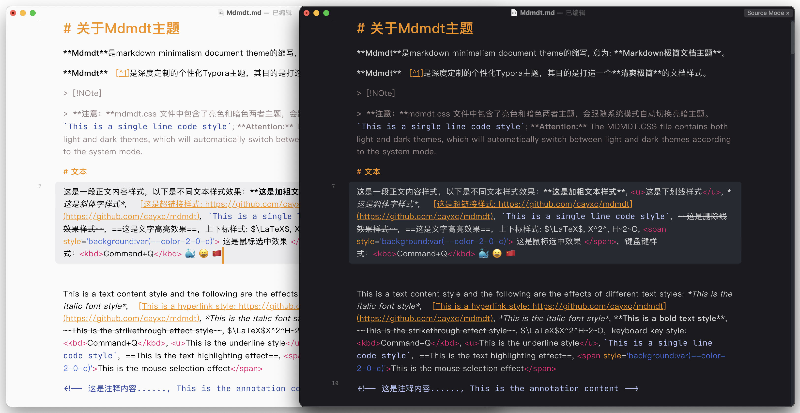
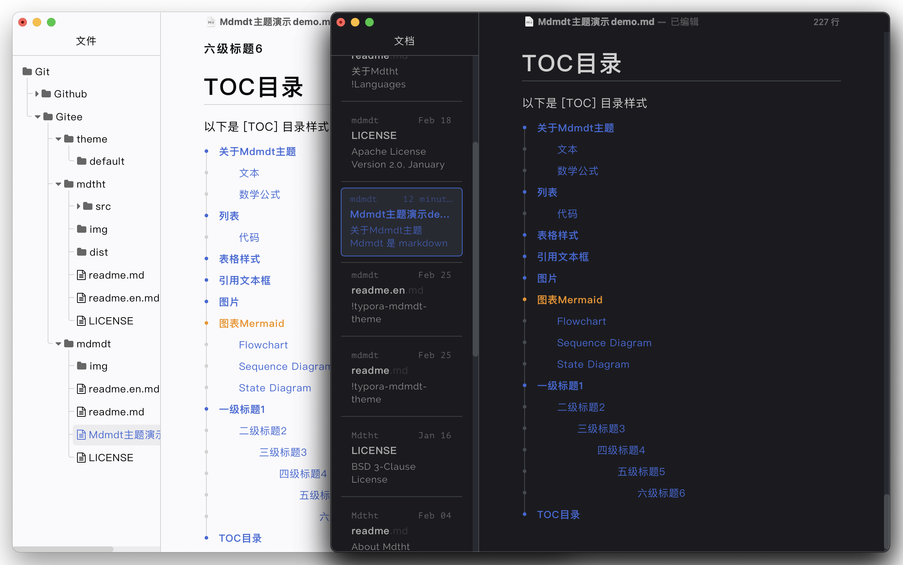

# 关于Mdmdt主题

#### [English Document](./readme.md)

**Mdmdt** 是 markdown minimalism document theme 的缩写，意为：**Markdown极简文档主题**。
**Mdmdt** 是深度定制的个性化Typora主题，其目的是打造一个 **清爽极简** 的文档样式。**Mdmdt** 主题现已收录至 [Typora官方主题库https://theme.typoraio.cn](https://theme.typoraio.cn/).

相比于默认主题风格主要修改了以下几个方面：
1. 简洁舒适的配色风格
2. 修改标题样式
3. 修改表格样式
4. 修改引用框样式
5. 为图片添加圆角样式
6. 代码添加高亮样式
7. 修改文件树、大纲和文档列表样式
8. 自动跟随系统的亮色/暗色主题模式（可单独设置亮/暗主题)
9. 修改其他UI样式

> [!IMPORTANT]
>
> **注意：**该主题只在 Windows 和 MacOS 环境下测试过，Linux环境下未做测试，使用时还请注意！

# 预览

---

# 如何使用

使用自定义主题非常简单，方法如下：
1. 打开 `偏好设置` -> `外观` -> `打开主题文件夹`
2. 将下载好的 `mdmdt.cs文件` 复制到主题文件夹下
3. **退出 Typora 重新打开**，在 `菜单栏` -> `主题` 选择 **Mdmdt** 主题，完成主题切换。

> [!NOTE]
>
> **注意：**mdmdt.css 文件中包含了亮色和暗色两者主题，会跟随系统模式自动切换亮暗主题。

##### 使用单独的亮色/暗色主题

如果只想使用单独的亮色或暗色主题，方法如下：
1. 打开 `偏好设置` -> `外观` -> `打开主题文件夹`
2. 复制 `mdmdt-light.css` 或者 `mdmdt-dark.css` 到 `主题文件夹下`
3. 重新打开Typora，在 `菜单栏` -> `主题` 选择 **Mdmdt Ligh** 或者 **mdmdt Dark** 主题，完成主题切换。

# 修改字体

如果您对字体不满意，可以参照如下方法修改相应的字体：

1. 修改正文字体，找到：`font-family: "PingFang SC", "Microsoft YaHei", Arial, "Helvetica Neue", Helvetica, sans-serif;` 在 “font-family:” 后第一个位置添加你想使用的字体，如：`font-family: "想使用的字体名称", "PingFang SC", ..., sans-serif;`；Windows环境下修改正文字体，找到：`body.os-windows{...}`，按照前面方式修改。
2. 修改代码字体，找到：`--monospace: "JetBrains Mono", "Source Code Pro", "Fira Code", Consolas, Inconsolata, "Cascadia Code", Monaco, "Ubuntu Mono", monospace;`， 然后在其第一个位置添加你想使用的字体，如：`--monospace: "想使用的字体名称", "JetBrains Mono", ..., monospace;`

**注意：更换字体的前提是你电脑上要安装有相应的字体，否则修改无效**。如果您不了解 CSS 的 "font-family" 属性，可以参考这里：https://developer.mozilla.org/zh-CN/docs/Web/CSS/font-family

# 导出html

想要导出 html 文件可以直接选择当前主题导出 html

**如果想要导出的 html 文件能自定义更多样式，可以使用 Mdtht 插件：**

插件主页地址：[Mdtht-Gitub地址](https://github.com/cayxc/Mdtht)   [Mdtht-Gitee地址](https://gitee.com/cayxc/mdtht)

该插件提供了如下丰富功能：

1. 跟随系统自动切换亮色/暗色模式。
2. 手动切换亮色/暗色模式。
3. 自动生成目录编号和正文区标题索引。
4. 可选择将第一个标题转换为文章标题，并将标题居中。
5. 根据正文中标题的位置自动纠正目录层级。
6. 显示/隐藏目录索引编号。
7. 3种目录按钮样式切换。
8. 根据当前阅读区位置自动追踪到所在目录和上层目录。
9. 一键展开收起子目录。
10. 一键展开收起侧边栏。
11. 目录搜索。
12. 代码高亮。
13. 文字阴影模式。

**mdtht.js** 插件具体详情请参考插件主页。

**mdtht.js导出为 html 效果图（亮色）**

---

 **mdtht.js导出为 html 效果图（暗色）**

---

---

🐳 如果您喜欢该文档样式风格，还请给一个 star 😄，使用过程中有什么问题请及时提交 issues，看到后我会第一时间处理。

